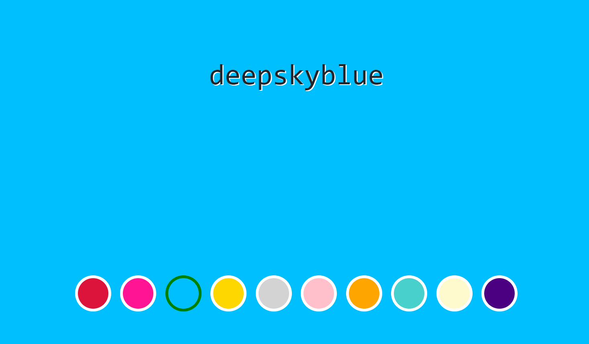

# Change color app

---

Responsive web application for changing the background color. You can change using the buttons or simply by reloading the page.

Technologies

1. React
2. JavaScript
3. Scss
4. HTML

Link

